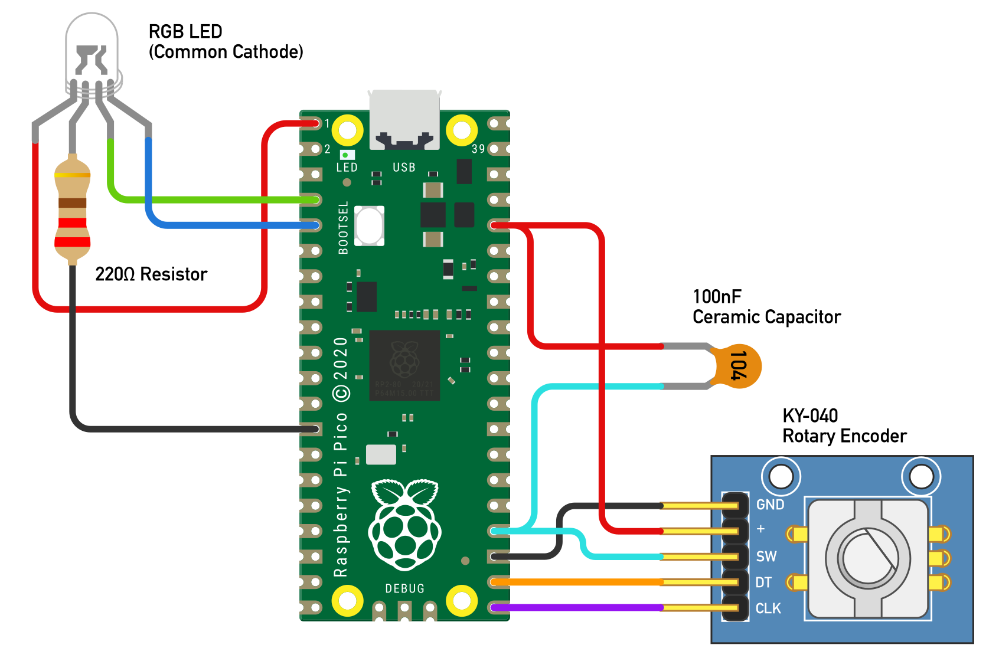

# RGB LED controlled by rotary encoder

This is a simple script in micropython for elegantly controlling a RGB LED using the KY-040 rotary encoder.
Rotate the dial to change the amount of selected color in increments of 1/20. Press the switch to change the selected color.

# Hardware

* Raspberry Pi pico
* KY-040 Rotary Encoder
* RGB LED (Common Cathode)
* 100nF Ceramic Capacitor
* Jumper Cables
* Breadboard
* Micro-USB Cable connected to your computer
* [Thonny IDE](https://thonny.org/) for uploading scripts to the Pico

# Wiring Diagram

# Known issues

This hardware method of debouncing the switch using the 100nF capacitor is not very optimal. It seems to work fine, but sometimes it goes two steps at a time. I couldn't find any better methods, and didn't want to implement in software because it's using interrupts.
Sometimes, when selecting a color, another one seems to go in the opposite direction at the same time. Not sure what causes this.

# Acknowledgements

Huge thanks to Mike Teachman for his brilliant micropython [library](https://github.com/MikeTeachman/micropython-rotary) for using rotary encoders.
This script is made available to the public using the [Creative Commons Atributtion / Share alike 4.0 license](https://creativecommons.org/licenses/by/4.0/).
